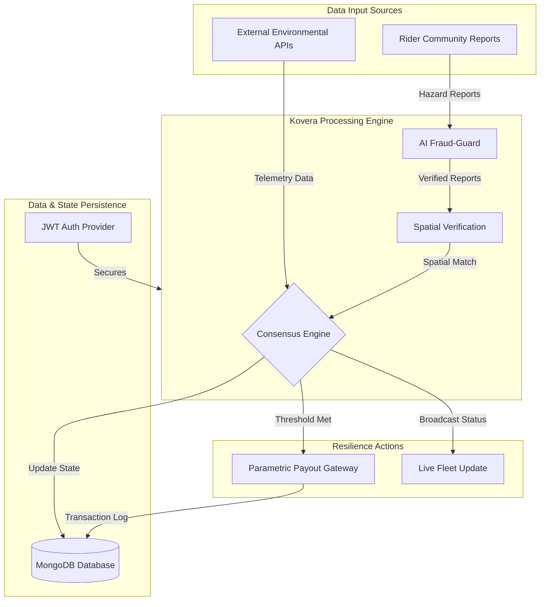
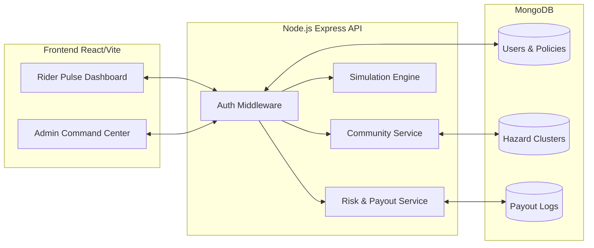

# Kovera AI - The Resilience Layer for the Gig Economy

Kovera AI is a next-generation resilience platform designed specifically for the gig economy. Moving beyond traditional insurance models, Kovera leverages real-time environmental data and Community-Driven Proof (C-Proof) to provide instantaneous financial protection for delivery partners and gig workers.

## The Mission: Collective Resilience

The gig economy is highly vulnerable to external disruptions. Extreme weather, traffic gridlock, and hyper-local hazards such as street-level flooding can halt earnings instantly. Kovera AI addresses this gap by combining algorithmic risk assessment with crowdsourced hazard reporting. When the collective reports a disruption, the "Resilience Trigger" activates, ensuring riders are compensated for their loss of income without the need for manual claims or long waiting periods.

## Core Concepts

### Community-Driven Proof (C-Proof)
Kovera's primary differentiator is C-Proof. Instead of relying solely on delayed reports from official weather stations, the platform listens to the community.
- **Hyper-local Hazard Reporting**: Riders can report active flooding, accidents, or road closures in real-time.
- **Consensus-Based Triggers**: If a threshold number of riders in a specific radius report the same disruption, an automatic payout event is initialized for all covered partners in that zone.

### Parametric Resilience Triggers
Insurance payouts are parametric, meaning they are triggered by specific, measurable data points rather than subjective loss assessments. When predefined environmental or community thresholds are met, payouts are processed automatically.

## Key Features

### Pulse Dashboard (Rider Experience)
- **Glassmorphic UI**: A premium, high-performance interface providing real-time visibility into active coverage and risk scores.
- **Rapid Hazard Reporting**: A simplified reporting tool that allows riders to contribute to the community's safety net with minimal interaction.
- **Automated Payout History**: Transparent tracking of all resilience-triggered payouts and upcoming coverage details.
- **Onboarding and Policies**: Streamlined process for selecting coverage zones and understanding risk multipliers.

### Kovera Command Center (Admin & Fleet Management)
- **Live Resilience Heatmap**: Real-time visualization of rider density, active hazard clusters, and payout hotspots using React-Leaflet.
- **Adaptive Pricing Engine**: Dynamic adjustment of risk-multipliers based on live community feedback and sensor telemetry.
- **Fraud-Guard AI**: Advanced behavioral auditing systems to ensure community reports are authentic and verified by GPS data.
- **Fleet Analytics**: Detailed breakdown of active riders, policy coverage, and financial performance metrics.

## Technical Architecture

The platform is built on the MERN stack with a focus on real-time data processing and modular architecture.

### System Data Flow

The following diagram illustrates how Kovera AI processes multi-source data to trigger resilience payouts.



### Component Interaction

This diagram represents the relationship between the various system components and user interfaces.



### Frontend Architecture
- **React 18**: Component-based UI with interactive state management.
- **Leaflet.js**: High-performance mapping for the live heatmap.
- **Recharts**: Data visualization for rider earnings and system-wide analytics.
- **Vanilla CSS**: Custom glassmorphic design system for a premium user experience.

### Backend
- **Node.js & Express**: Scalable API architecture for handling real-time reports and admin controls.
- **MongoDB**: Categorical and spatial storage for hazard reports, rider profiles, and payout logs.
- **JWT Security**: Role-based access control for riders and administrators.

### AI Risk Engine
- **Spatial Consistency Check**: Validates reports by cross-referencing rider GPS coordinates with reported hazard locations.
- **Reliability Scoring**: Weights reports based on the historical accuracy of the reporting rider.
- **Anomaly Detection**: Identifies patterns of coordinated false reporting or spoofing.

## Installation and Setup

### Prerequisites
- Node.js (v18 or higher)
- MongoDB (Local instance or Atlas URI)
- npm or yarn

### Clone the Repository
```bash
git clone https://github.com/abhinavshankar17/GigShield-AI.git
cd GigShield-AI
```

### Backend Setup
1. Navigate to the server directory:
   ```bash
   cd server
   ```
2. Install dependencies:
   ```bash
   npm install
   ```
3. Create a `.env` file in the `server` root:
   ```env
   PORT=5000
   MONGODB_URI=your_mongodb_connection_string
   JWT_SECRET=your_jwt_secret_key
   ```
4. Seed the database with initial data:
   ```bash
   node src/seed.js
   ```
5. Start the server:
   ```bash
   npm run dev
   ```

### Frontend Setup
1. Navigate to the client directory:
   ```bash
   cd client
   ```
2. Install dependencies:
   ```bash
   npm install
   ```
3. Create a `.env` file in the `client` root:
   ```env
   VITE_API_BASE_URL=http://localhost:5000/api
   ```
4. Start the development server:
   ```bash
   npm run dev
   ```

## Project Structure

```text
GigShield-AI/
├── client/                 # React frontend (Vite)
│   ├── src/
│   │   ├── components/     # Reusable UI components
│   │   ├── context/        # State management (Admin/Auth)
│   │   ├── pages/          # Page-level components
│   │   ├── services/       # API integration layers
│   │   └── utils/          # Helper functions and constants
├── server/                 # Express backend
│   ├── src/
│   │   ├── controllers/    # Business logic for routes
│   │   ├── models/         # MongoDB schemas (User, Policy, Report)
│   │   ├── routes/         # API endpoint definitions
│   │   ├── services/       # Core AI and simulation logic
│   │   └── seed.js         # Database initialization script
```

## API Documentation Overview

### Authentication
- `POST /api/auth/login`: Authenticate as a rider or admin.
- `GET /api/auth/session`: Retrieve current session status.

### Community & Hazards
- `GET /api/community/hazards`: Fetch active hazard clusters for the map.
- `POST /api/community/report`: Submit a new hazard report (C-Proof).

### Admin Controls
- `GET /api/admin/riders`: Retrieve all registered riders and their status.
- `GET /api/admin/analytics`: Get system-wide resilience metrics.

### Simulation
- `POST /api/simulation/trigger`: Manually simulate a disruption for testing payout logic.

## Usage and Simulation
To test the Resilience Trigger, use the Admin Dashboard Simulation tool. You can manually create a "Hazard Event" in a specific zone. If the required number of reports is reached (or simulated), you will see the Pulse Dashboard update with an automatic "Parametric Payout" notification.

## Disclaimer
Kovera AI is a proof-of-concept platform developed for resilience research. It does not provide real insurance products or financial advice. All payout simulations are for demonstration purposes only.

Kovera AI - Resilience, Powered by the Collective.

