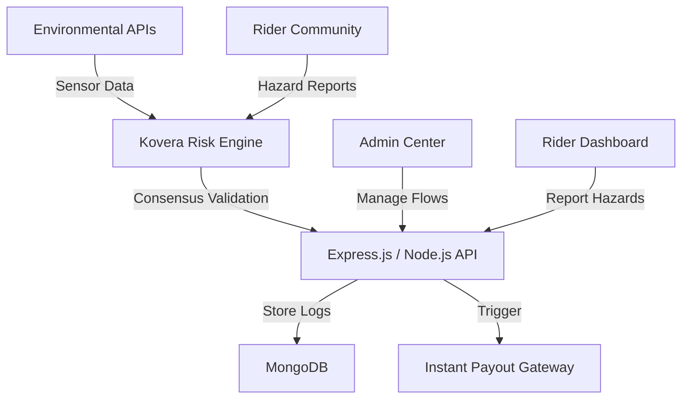

# Kovera AI – The Community-Driven Resilience Layer

**Kovera AI** is a next-generation resilience platform designed for the gig economy. Moving beyond traditional insurance, Kovera leverages real-time environmental data and **Community-Driven Proof (C-Proof)** to provide instant financial protection for delivery partners and gig workers.

---

## 🚀 The Mission: Resilience Through the Collective
The gig economy is volatile. Extreme weather, traffic gridlock, and hyper-local hazards (like street-level flooding) can halt earnings instantly. **Kovera AI** fills this gap by combining algorithmic risk assessment with crowdsourced hazard reporting. When the collective reports a disruption, the "Resilience Trigger" activates.

---

## ✨ Key Features

### 🛡️ Community Verification (C-Proof)
Our "opinionated" differentiator. Instead of waiting for official weather stations to catch up, Kovera listens to its users.
*   **Hyper-local Hazard Reporting**: Riders can report active waterlogging, accidents, or road closures.
*   **Consensus-Based Triggers**: If multiple riders in a specific radius report the same disruption, an automatic layout is initialized for all covered partners in that zone.

### 🛠️ Kovera Command Center (Admin)
*   **Live Resilience Heatmap**: Real-time visualization of rider density and active hazard clusters.
*   **Adaptive Pricing Engine**: Dynamic adjustment of risk-multipliers based on live community and sensor telemetry.
*   **Fraud-Guard AI**: Behavioral auditing to ensure community reports are genuine and not spoofed.

### 📱 Pulse Dashboard (Rider)
*   **Glassmorphism UI**: A premium, high-performance interface showing active coverage and real-time risk scores.
*   **Rapid Hazard Report**: One-tap reporting to contribute to the community's safety net.
*   **Automated Near-Instant Payouts**: Parametric triggers ensure payouts hit the wallet the moment thresholds are met.

---

## 💻 Tech Stack

**Frontend:** React 18, Leaflet.js, Recharts, Vanilla CSS (Glassmorphic Design).
**Backend:** Node.js, Express, MongoDB, JWT Security.
**AI Core:** Risk Engine for consensus-based validation and anomaly detection.

---

## 📊 System Architecture

---

## 🛠️ AI Core & Fraud Detection
Kovera uses a "Proof-of-Presence" model:
*   **Spatial Consistency**: Reports are only valid if the rider's GPS confirms they are in the reported hazard zone.
*   **Consensus Weighting**: Higher trust is given to riders with high "Reliability Scores."
*   **Behavioral Auditing**: Detecting patterns that suggest coordinated false reporting.

---

*Powering the workforce through collective resilience.*
**Kovera AI – Resilience, Powered by the Collective.**
